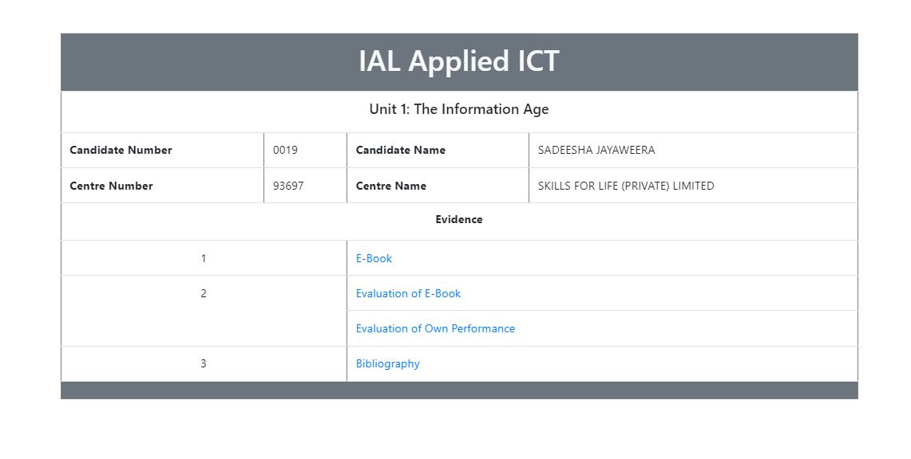

# Ebook: The Information Age

  

## Introduction

Welcome to **"Exploring the Digital Landscape"**, an ebook that delves into various aspects of the online world and its impact on society. In this comprehensive guide, we will explore topics such as Online Services, Life in the Information Age, and The Digital Divide. By the end of this ebook, you will gain a deeper understanding of the digital landscape and its significance in today's interconnected world.

## Table of Contents

1. [Online Services](#online-services)
2. [Life in the Information Age](#life-in-the-information-age)
3. [The Digital Divide](#the-digital-divide)
4. [Conclusion](#conclusion)
5. [Bibliography](#bibliography)

## Online Services 

In this chapter, we will delve into the world of online services. We will explore the diverse range of services available on the internet, their benefits, and how they have transformed various aspects of our lives. From e-commerce platforms to social networking sites, we will examine the evolution and impact of online services on individuals and businesses alike.

## Life in the Information Age 

The Information Age has revolutionized the way we live, work, and communicate. In this chapter, we will explore the profound changes brought about by the rapid advancement of technology and the internet. We will discuss how information is now readily accessible, the rise of digital media, and the implications of this new era on society, economy, and culture.

## The Digital Divide 

Despite the increasing ubiquity of technology, a digital divide still exists in our world. In this chapter, we will examine the factors contributing to this divide, including access to technology, internet connectivity, and digital literacy. We will also discuss the consequences of the digital divide on education, employment, and social equality, and explore potential solutions to bridge this gap.

## Conclusion 

As we reach the end of our journey through the digital landscape, it is clear that the online world has become an integral part of our lives. We have explored the vast array of online services, the transformative nature of the Information Age, and the challenges posed by the digital divide. It is essential for individuals, communities, and governments to work together to harness the benefits of technology while ensuring inclusivity and equitable access for all.

## Bibliography 

1. Author's Last Name, First Name. "Title of Source." Publisher, Year.
2. Author's Last Name, First Name. "Title of Source." Publisher, Year.
3. Author's Last Name, First Name. "Title of Source." Publisher, Year.

*Note: The bibliography should include the sources you used for your research, formatted according to your preferred citation style.*

## About the Author

This ebook was created by Sadeesha Jayawwera. It serves as the coursework submission for the London Advanced Level Unit 1. The author developed the website using HTML, CSS, JavaScript, and Bootstrap, showcasing their skills in web development.

For any questions or feedback, please reach out to sadeesha.jayaweera@gmail.com.

Thank you for exploring the digital landscape with us!
